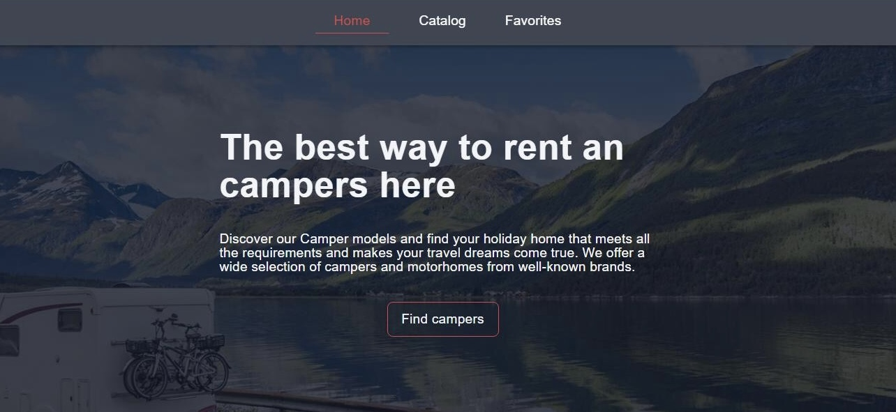
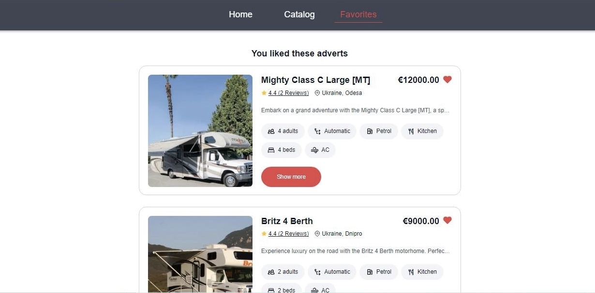

# Campers-for-rent

This project was created with the help of [Create Vite](https://vitejs.dev/).

This application for a company that provides camper van rental services.

## About the project

The app will help travelers explore the Campers models and find their travel
home that meets all the requirements and fulfills all their travel dreams.

TThe application consists of 3 pages: the Home page, the Catalog and the page
with ads selected as favorites.

## Home page

The home page presents basic information about the company and the site
navigation panel 

## Catalog

This page presents a list of ads containing information about the camper. When
you click on the button with the image of a heart, the ad is added to the list
of favorites. Clicking the Show more button opens a modal window with detailed
information about the camper

## Favorites page

This page contains a list of ads added to your favorites

## Technologies used:

- JavaScript
- React
- HTML
- CSS
- Git
- GitHub
- Vite

## Used libraries:

- axios
- formik
- react-loader-spinner
- react-modal
- react-redux
- react-router-dom
- redux-persist
- styled-components
- yup
